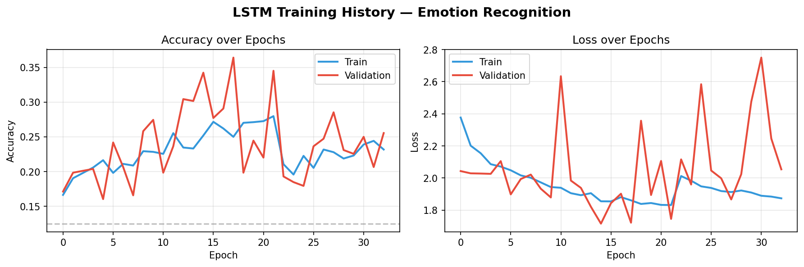
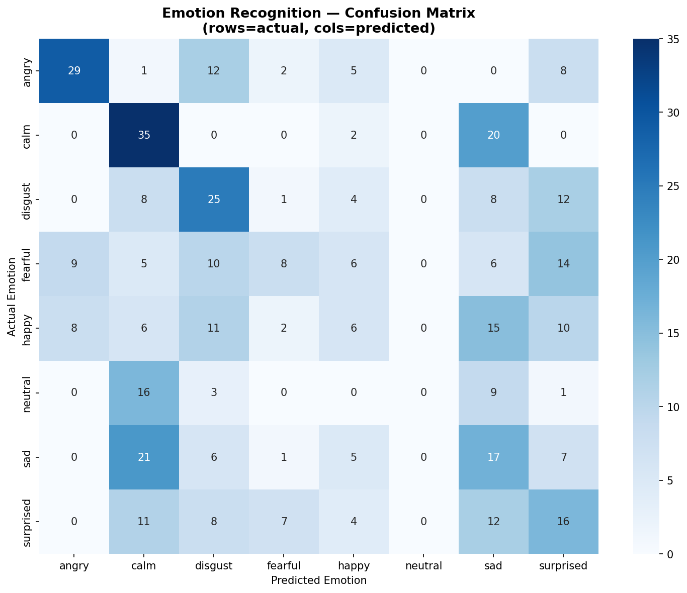

# 🎙️ Emotion Recognition from Speech
### CodeAlpha Machine Learning Internship — Task 2

## Overview
Classifies 8 human emotions from speech audio using
MFCC feature extraction and a stacked LSTM network
trained on the RAVDESS dataset.

## Results
| Metric | Value |
|--------|-------|
| Test Accuracy | 25.5% |
| Random Baseline | 12.5% |
| Improvement | 2x better than random |
| Best Emotion | Angry |
| Hardest Emotion | Neutral |

## Key Finding
Calm, sad and neutral emotions share very similar
acoustic profiles — consistent with human psychology
research showing humans also struggle to distinguish
these emotions from voice alone.

## Dataset
- RAVDESS: 2880 audio files
- 24 professional actors
- 8 emotion classes
- 220 features extracted per file

## Tech Stack
- Python, TensorFlow, Librosa, Scikit-learn

## Charts

